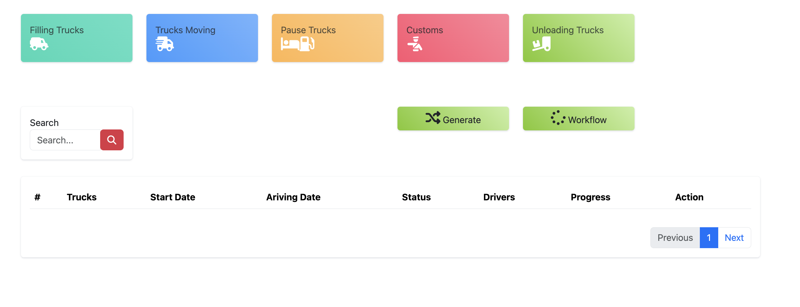
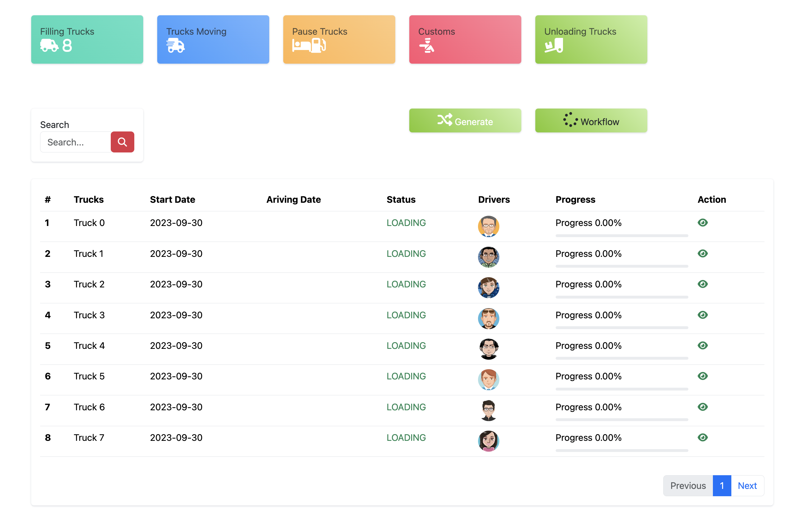
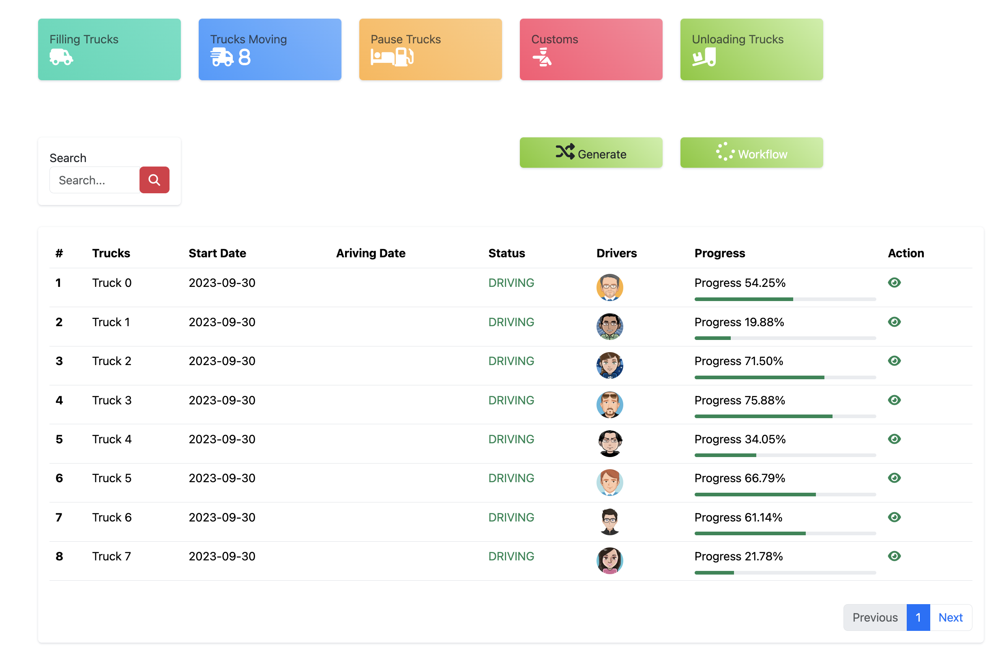
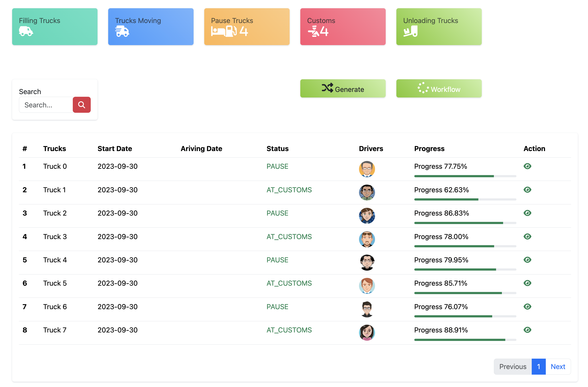

# TRUCK APP 

## Expectations
- Small app to show KAFKA integration , how to configure kafka with Spring and Simulate produce and consume data. 

### Installation
- 1 . Go to https://kafka.apache.org/downloads
- 2 . Downoad Scala 2.13  - kafka_2.13-3.5.1.tgz
- 3 . Unzip it
- 4 . In terminal write KAFKA_CLUSTER="$(bin/kafka-storage.sh random-uuid)"
- 5 . bin/kafka-storage.sh format -t $KAFKA_CLUSTER -c config/kraft/server.properties
- 6 . bin/kafka-server-start.sh /config/kraft/server.properties
- 7 . to install the front part under src/main/js => npm install

### Usage of the application

- 1 . Under src/main/js => ng serve
- 2 . Start the back also (you need postgres DB or docker )
- 3 . Generate function: It will generate random data (Driver,Route,Truck and Journey)
- 4 . To progress the workflow from Filling truck to unloading truck , you need just to click on Workflow button and wait :)

https://github.com/jabranemohamed/truck-crm/assets/6950420/f01f138b-3eef-4c0a-a584-8e3db1cb4342

